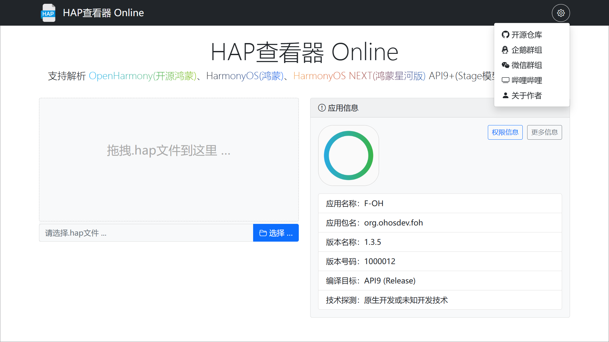
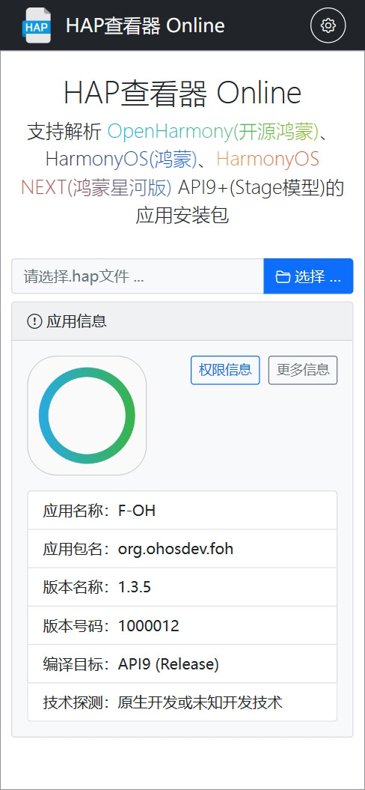

# HapViewerWeb


## 项目介绍

> 技术咨询请来这里：[关于作者](https://kaihongpai.feishu.cn/wiki/CqWLwJRadibxztkrIWZcogWxnXd)

网页版的hap查看器，支持解析 OpenHarmony(开源鸿蒙)、HarmonyOS(鸿蒙)、HarmonyOS NEXT(鸿蒙星河版) API9+(Stage模型)的应用安装包

演示地址：http://107.174.127.150:9090

开源仓库

- [Gitee](https://gitee.com/westinyang/hap-viewer-web)
- [Github](https://github.com/westinyang/hap-viewer-web)

### 系列项目

- 电脑版（跨平台）：[westinyang/hap-viewer](https://gitee.com/westinyang/hap-viewer)
- 手机版（Android）：[westinyang/hap-viewer-android](https://gitee.com/westinyang/hap-viewer-android)
- **网页版（响应式）**：[westinyang/hap-viewer-web](https://gitee.com/westinyang/hap-viewer-web)

## 下载安装

- https://gitee.com/westinyang/hap-viewer-web/releases

## 使用说明

Windows

> HapViewerWeb-*-windows-amd64.zip `Native Image, no jvm required`

```shell
hap-viewer-web.exe # 默认端口9090
hap-viewer-web.exe --server.port=8888 # 指定端口运行
```

Linux

> HapViewerWeb-*-linux-amd64.tar.gz `Native Image, no jvm required`

```shell
./hap-viewer-web # 默认端口9090
./hap-viewer-web --server.port=8888 # 指定端口运行
```

Mac

> 暂未单独编译mac版的本机可执行文件，可以使用`跨平台（jar）`方式运行，或者拉取代码自行编译，环境配置请考我的另一个开源项目：[westinyang/java-graalvm-start](https://gitee.com/westinyang/java-graalvm-start)

跨平台（jar）

> HapViewerWeb-*.jar `JDK 21+, Require jvm`

```shell
java -jar HapViewerWeb-*.jar # 默认端口9090
java -jar HapViewerWeb-*.jar  --server.port=8888 # 指定端口运行
```

## 开发技术

> GraalVM让Java再次变得强大，使用`NativeImage`把程序编译为目标平台的可执行文件，脱离jvm直接运行，启动速度快，内存负载低。  
> 关于GraalVM技术的最佳实践和教程，请参考我的另一个开源项目：[westinyang/java-graalvm-start](https://gitee.com/westinyang/java-graalvm-start)

- 后端
  - GraalVM JDK21 (Native Image)
  - Spring Boot 3.x
  - Hutool 5.x
- 前端
  - jquery 3.x
  - bootstrap 5
  - bootstrap-fileinput
  - bootstrap-icons
  - clipboard
  - layer

## 截图预览

电脑版式



移动版式



## 视频演示

x

## 许可声明

- 本项目是以Apache2.0许可开源，如需二开、衍生或商用请注明原作者和原仓库

## 技术交流

[🐧 加入OpenHarmony技术交流群](https://kaihongpai.feishu.cn/wiki/R93ywdop6iuryDkJ5ACc0L3ynEc)

## 赞助支持

[🧧 访问开源项目赞助支持页面](https://kaihongpai.feishu.cn/wiki/XaVUwmiJTiYvtDktzalcHbRpnNk)
